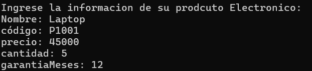
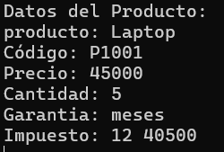
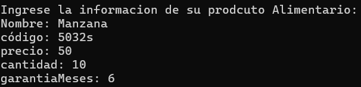
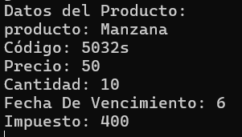

# Sistema de Gestión de Inventario

# 📌 Descripción del Repositorio

Este repositorio contiene la solución de una representa basica de productos de una tienda y calcula impuestos
dependiendo del tipo de producto.

programas fueron desarrollados en C#

## Estructura del programa

### Clase base

`Producto`

Atributos: 
- nombre 
- codigo
- precio
- cantidad

Métodos:
- MostrarProducto()
- CalcularImpuesto()

### Clases derivadas

#### ProductoElectronico

Atributos adicionales: 
- garantiaMeses

Regla de impuesto: 
- 18% del precio

explicado:
- para los Productos Electronicos se ingresa nombre, codigo, precio, cantidad y la garantia en meses

Ejemplo De Salidad:
- 📷 Capturas de Pantalla

- 
- 

#### ProductoAlimento

Atributos adicionales: 
- fechaVencimiento

Regla de impuesto: 
- 8% del precio

explicado:
- para los Productos Alimentarios se ingresa nombre, codigo, precio, cantidad y la fecha de vencimiento

Ejemplo De Salidad:
- 📷 Capturas de Pantalla
- 
- 

